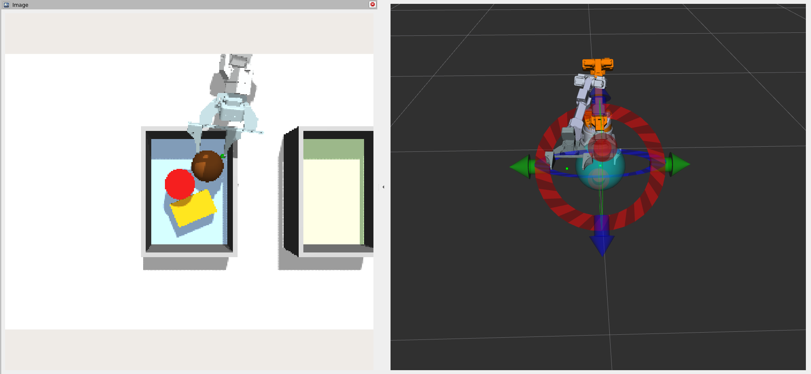

# RobotSim: Alicia-D 智能抓取仿真系统

本仓库是一个基于 **ROS 2 Humble + Gazebo Fortress + MoveIt2** 的 Alicia-D 六自由度机械臂抓取仿真项目。系统在 Gazebo 中加载 Alicia-D 机械臂、100mm 平行夹爪、RGB-D 相机和多个测试物体，通过 ROS 2 节点完成颜色感知、任务状态机决策、MoveIt2 轨迹规划与执行，实现多个物体的自动抓取与放置闭环。



## 1. 项目架构

```text
Gazebo Fortress / Ignition
  ├── Alicia-D 6-DOF robot
  ├── 100mm parallel gripper
  ├── RGB-D camera
  └── test objects

ROS 2 Humble
  ├── robot_state_publisher
  ├── gz_ros2_control
  ├── MoveIt2 move_group
  ├── RViz2
  └── perception_mvp
      ├── color_perception_node        # 颜色感知
      ├── move_to_pregrasp_node        # MoveIt2 执行节点
      └── task_state_machine_node      # 抓取任务状态机
```

## 2. 目录结构

```text
RobotSim/
├── README.md
├── setup_env.sh
├── cleanup.sh
├── alicia_gz_sim/
│   ├── config/
│   │   └── alicia_d_ros2_controllers.yaml
│   ├── models/
│   └── worlds/
└── src/
    ├── alicia_d_descriptions/
    │   ├── meshes/
    │   └── urdf/
    ├── alicia_moveit_config/
    │   ├── config/
    │   └── launch/
    └── perception_mvp/
        └── perception_mvp/
            ├── color_perception_node.py
            ├── move_to_pregrasp_node.py
            └── task_state_machine_node.py
```

## 3. 环境要求

推荐环境：

- Ubuntu 22.04
- ROS 2 Humble
- Gazebo Fortress / Ignition
- MoveIt2
- Python 3.10

常用依赖安装：

```bash
sudo apt update

sudo apt install -y \
  git \
  python3-colcon-common-extensions \
  python3-pip \
  ros-humble-moveit \
  ros-humble-gz-ros2-control \
  ros-humble-ros-gz-bridge \
  ros-humble-ros-gz-sim \
  ros-humble-joint-trajectory-controller \
  ros-humble-joint-state-broadcaster \
  ros-humble-controller-manager \
  ros-humble-robot-state-publisher \
  ros-humble-xacro \
  ros-humble-rviz2 \
  ros-humble-tf2-ros

pip3 install pymoveit2
```

如果在 WSL2 / 虚拟机中运行，图形和渲染能力可能受限。当前 launch 默认使用 headless Gazebo，主要通过 RViz2 观察机器人和规划结果。

## 4. 克隆仓库

HTTPS 克隆：

```bash
cd ~
git clone https://github.com/KaiSANG121/RobotSim.git
cd ~/RobotSim
```

## 5. 编译

第一次 clone 后必须编译：

```bash
cd ~/RobotSim
source setup_env.sh
colcon build --symlink-install
source install/setup.bash
```

## 6. 启动仿真和节点

建议使用 4 个终端：一个 launch 仿真，三个分别启动感知、执行、状态机节点。

### 6.1 终端 1：启动 Gazebo + MoveIt2 + RViz2

```bash
cd ~/RobotSim
source setup_env.sh
source install/setup.bash
bash ~/RobotSim/cleanup.sh
ros2 launch alicia_moveit_config sim_demo.launch.py
```

说明：

- `cleanup.sh` 用于清理上一次仿真残留的 `move_group`、controller、Gazebo 相关进程。
- 建议每次重新 launch 前都先执行 cleanup。
- launch 成功后，等待终端出现类似 `You can start planning now!`。

### 6.2 终端 2：启动颜色感知节点

```bash
cd ~/RobotSim
source setup_env.sh
source install/setup.bash

ros2 run perception_mvp color_perception_node --ros-args -p use_sim_time:=true
```

### 6.3 终端 3：启动 MoveIt2 执行节点

```bash
cd ~/RobotSim
source setup_env.sh
source install/setup.bash

ros2 run perception_mvp move_to_pregrasp_node --ros-args -p use_sim_time:=true
```

### 6.4 终端 4：启动任务状态机节点

```bash
cd ~/RobotSim
source setup_env.sh
source install/setup.bash

ros2 run perception_mvp task_state_machine_node --ros-args -p use_sim_time:=true
```

`use_sim_time:=true` 很重要。Gazebo 发布的是仿真时间，如果节点不用仿真时间，MoveIt2 可能认为 `/joint_states` 时间戳过旧，从而拒绝执行轨迹。

## 7. 推荐启动顺序

建议顺序：

1. 启动 `sim_demo.launch.py`。
2. 等待 MoveIt2 和 controller 完全 ready。
3. 启动 `color_perception_node`。
4. 启动 `move_to_pregrasp_node`。
5. 最后启动 `task_state_machine_node`。

状态机启动后会按目标顺序执行抓取流程：检测目标、移动到预抓取位姿、夹爪闭合、移动到放置位姿、夹爪打开，然后切换下一个目标。

## 8. 当前夹爪控制状态

当前夹爪使用：

- `Gripper_controller`
- `FollowJointTrajectory`
- `effort` command interface
- controller PID
- `right_finger` 通过 URDF mimic 跟随 `Gripper`

关键配置文件：

```text
alicia_gz_sim/config/alicia_d_ros2_controllers.yaml
src/alicia_moveit_config/config/alicia_d.ros2_control.xacro
src/alicia_d_descriptions/urdf/Alicia_D_v5_6/Alicia_D_v5_6_gripper_100mm.urdf
```

当前 PID 参数：

```yaml
gains:
  Gripper:
    p: 200.0
    i: 0.5
    d: 5.0
    i_clamp: 10.0
    ff_velocity_scale: 0.0
```

## 9. Topic 接口概览

感知节点常用输出：

| Topic | 类型 | 说明 |
| --- | --- | --- |
| `/perception/current_target_visible` | `std_msgs/Bool` | 当前目标是否可见 |
| `/perception/current_target_point_world` | `geometry_msgs/PointStamped` | 当前目标世界坐标 |
| `/perception/current_target_pregrasp_world` | `geometry_msgs/PointStamped` | 当前目标预抓取坐标 |
| `/perception/current_target_name_echo` | `std_msgs/String` | 当前目标名回显 |

状态机常用输出：

| Topic | 类型 | 说明 |
| --- | --- | --- |
| `/task/current_target_name` | `std_msgs/String` | 指示感知节点关注哪个目标 |
| `/task/enable_pregrasp` | `std_msgs/Bool` | 触发预抓取运动 |
| `/task/goal_pose_world` | `geometry_msgs/PoseStamped` | 放置目标位姿 |
| `/task/execute_goal_pose` | `std_msgs/Bool` | 触发放置运动 |
| `/task/gripper_command` | `std_msgs/Float64` | 夹爪命令，`0.0=open`，`0.05=close` |

执行节点常用反馈：

| Topic | 类型 | 说明 |
| --- | --- | --- |
| `/task/pregrasp_done` | `std_msgs/Bool` | 预抓取运动完成 |
| `/task/goal_pose_done` | `std_msgs/Bool` | 放置运动完成 |
| `/task/gripper_done` | `std_msgs/Bool` | 夹爪 action 完成 |
| `/task/gripper_success` | `std_msgs/Bool` | 夹爪 action 是否成功 |

---

最后更新：2026-04-29
