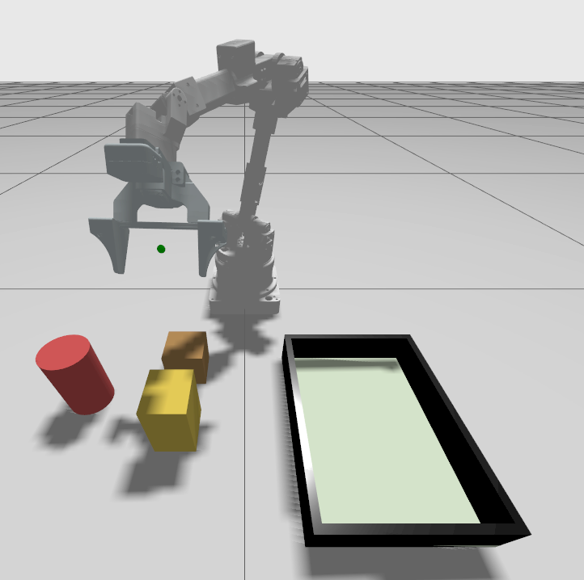
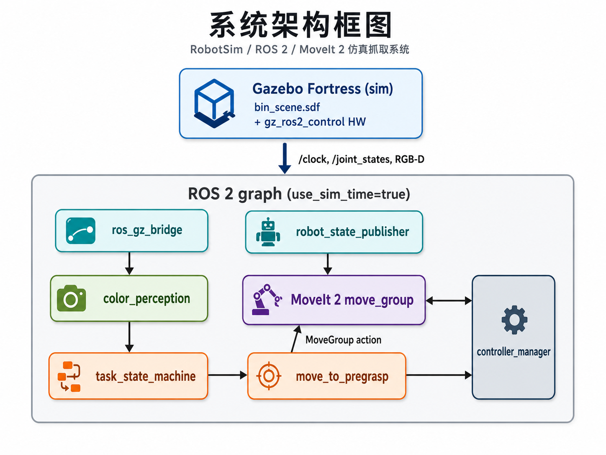
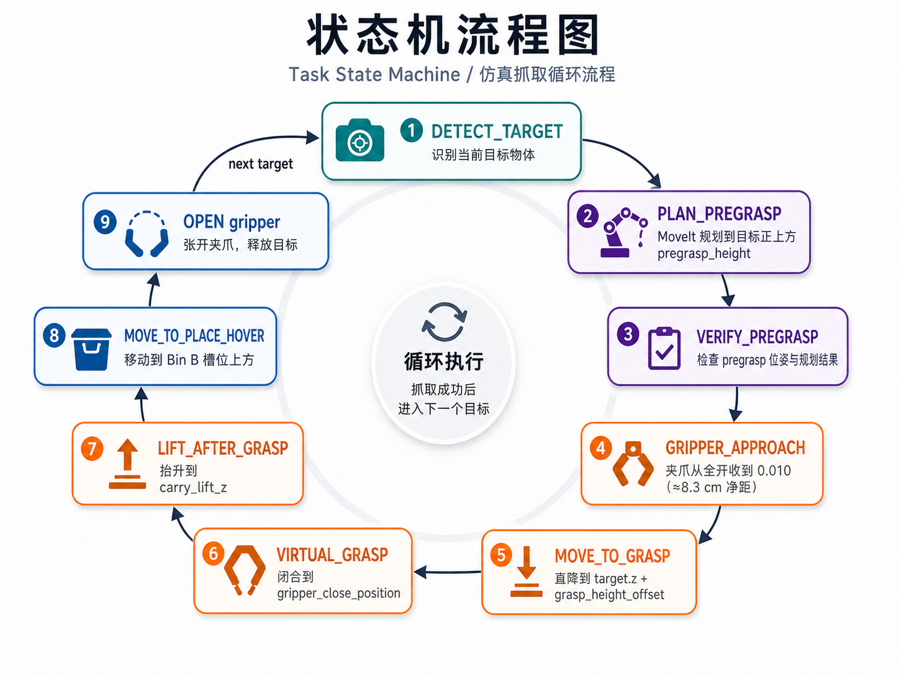

# RobotSim: Alicia-D 真实物理抓取仿真

基于 ROS 2 Humble、Gazebo Fortress (Ignition) 和 MoveIt 2 的 Alicia-D 六自由度机械臂顺序抓取仿真。系统使用顶视 RGB-D 相机做颜色感知，由有限状态机驱动 MoveIt 2 完成规划与执行，依靠 Gazebo 内置 collision、contact 与 friction 实现真实物理夹取。任务序列可通过 `target_sequence` 参数配置，默认包含三件物体（红色圆柱、黄色长方体、棕色正方体），状态机依次将其搬运到放置区 Bin B 的对应槽位。

整个过程不使用任何 `set_pose` 附着或 fixed-joint 黑盒——抓得起来与否完全取决于接触几何、摩擦系数和夹爪闭合力。



---

## 1. 系统架构



### 1.1 仿真侧

- **Gazebo Fortress** 加载 `alicia_gz_sim/worlds/bin_scene.sdf`：包含工作面、Bin B、三件待抓物体和顶视 RGB-D 相机。
- **gz_ros2_control** 在 Gazebo 进程内嵌入 `controller_manager`，加载：
  - `Alicia_controller`：6 关节 `JointTrajectoryController`，position 接口；
  - `Gripper_controller`：`JointTrajectoryController`，**effort** 接口，PID `p=60, d=4`，update_rate `100 Hz`；夹爪 `Gripper` 为 prismatic（行程 `0–0.05 m`），`right_finger` 为其 mimic（multiplier `-1`）；
  - `joint_state_broadcaster`：把 `/joint_states` 广播到 ROS 域（sim_time）。

### 1.2 ROS 2 侧（4 个节点）

| 节点 | 包 | 职责 |
| --- | --- | --- |
| `color_perception_node` | `perception_mvp` | 订阅顶视 RGB-D，对当前目标颜色做 HSV 阈值分割，把检测到的目标质心从相机系投到 `world` 系，发布 `/perception/current_target_point_world` |
| `move_to_pregrasp_node` | `perception_mvp` | 接收 `PoseStamped` 目标，调用 MoveIt 2 `MoveGroup` 做 Cartesian/joint 规划 + 执行；提供 gripper open/close action |
| `task_state_machine_node` | `perception_mvp` | 顺序遍历 `target_sequence`，发布每一阶段的目标位姿 / 夹爪命令，并在事件超时或失败时进入 declutter / retry |
| `move_group` | MoveIt 2 | 加载 `alicia_moveit_config` 的 SRDF / kinematics / planning_pipelines，提供 OMPL + Pilz 规划 |

`virtual_grasp_node` 仅在 `grasp_mode:=virtual` 时启动，本项目主线（physical）不使用。

### 1.3 状态机

`task_state_machine_node` 对 `target_sequence` 中的每一个目标顺序执行下图所示流程，任何阶段超时或返回 `STATUS_ABORTED` 都会落到 declutter 重试逻辑，最终在 `FINISHED` 终止：



---

## 2. 复现指引

### 2.1 系统要求

- Ubuntu 22.04
- ROS 2 Humble
- Gazebo Fortress / Ignition
- MoveIt 2
- Python 3.10
- 已验证平台：x86_64 桌面 / Jetson Nano（建议 4 GB+ swap）

### 2.2 首次安装依赖

```bash
sudo apt update
sudo apt install -y \
  git \
  python3-colcon-common-extensions \
  python3-pip \
  ros-humble-moveit \
  ros-humble-gz-ros2-control \
  ros-humble-ros-gz-bridge \
  ros-humble-ros-gz-sim \
  ros-humble-joint-trajectory-controller \
  ros-humble-joint-state-broadcaster \
  ros-humble-controller-manager \
  ros-humble-robot-state-publisher \
  ros-humble-xacro \
  ros-humble-rviz2 \
  ros-humble-tf2-ros

pip3 install pymoveit2
```

### 2.3 编译

```bash
cd ~/RobotSim
source setup_env.sh
colcon build --symlink-install
source install/setup.bash
```

`setup_env.sh` 同时设置 `GZ_SIM_RESOURCE_PATH`、`ROS_LOG_DIR` 与渲染环境（自动检测 WSL2 / Jetson / 独显）。

可选静态自检：

```bash
python3 -m py_compile src/perception_mvp/perception_mvp/*.py src/perception_mvp/launch/task_demo.launch.py
ign sdf -k alicia_gz_sim/worlds/bin_scene.sdf
xacro src/alicia_moveit_config/config/Alicia_D_v5_6_gripper_100mm.urdf.xacro > /dev/null
```

### 2.4 启动

每次启动前先清理可能残留的 controller_manager / move_group 进程：

```bash
cd ~/RobotSim
source setup_env.sh
source install/setup.bash
bash cleanup.sh
```

#### 终端 1 — Gazebo + MoveIt 2

```bash
cd ~/RobotSim && source install/setup.bash
ros2 launch alicia_moveit_config sim_demo.launch.py \
  headless:=false use_rviz:=false render_engine:=auto
```

启动顺序（自动）：Gazebo Sim → robot_state_publisher → spawn → controller_spawner → move_group → ros_gz_bridge → world→camera 静态 TF。等到日志输出：

```text
You can start planning now!
```

表示 `move_group` 已就绪。

#### 终端 2 — 抓取任务

```bash
cd ~/RobotSim && source install/setup.bash
ros2 launch perception_mvp task_demo.launch.py \
  grasp_mode:=physical grasp_style:=top_down
```

终端会持续打印每次状态切换和 MoveIt 规划结果。

#### 可选：覆盖序列或参数

```bash
# 自定义抓取顺序
ros2 launch perception_mvp task_demo.launch.py \
  target_sequence:="['brown_cube','yellow_box','red_cylinder']" \
  grasp_mode:=physical grasp_style:=top_down

# 单目标调试，强制更深的下爪
ros2 launch perception_mvp task_demo.launch.py \
  target_sequence:="['yellow_box']" \
  grasp_mode:=physical grasp_style:=top_down \
  grasp_height_offsets:="[-0.055]" \
  gripper_close_position:=0.040
```

### 2.5 启动开关参考

`sim_demo.launch.py`：

| 参数 | 取值 | 说明 |
| --- | --- | --- |
| `headless` | `true` / `false` | `true` 时 Gazebo server-only，`false` 时弹出 GUI |
| `use_rviz` | `true` / `false` | 是否启动 RViz（默认 `true`） |
| `render_engine` | `auto` / `ogre` / `ogre2` | `auto` 在 WSL2 软件渲染走 `ogre`，Jetson/独显走 `ogre2` |

`task_demo.launch.py`：

| 参数 | 默认 | 说明 |
| --- | --- | --- |
| `grasp_mode` | `virtual` | 物理抓取必须显式置为 `physical` |
| `grasp_style` | `auto` | `physical+auto` 当前解析为 `strict_top_down`；本项目主线显式用 `top_down` |
| `target_sequence` | `['red_cylinder','yellow_box','brown_cube']` | Python list 字面量 |
| `pregrasp_height` | `auto` (`0.20`) | 目标上方等待高度 |
| `grasp_height_offsets` | `auto` | 按目标几何自动给值 |
| `gripper_close_position` | `auto` (`0.040`) | 夹紧时 prismatic 行程 |
| `gripper_approach_position` | `auto` (`0.010`) | 下爪前部分闭合，避免侧向 clip |
| `place_slots_xyz` | `auto` | 按 `target_sequence` 取默认槽位 |
| `carry_lift_z` | `0.32` | 闭合后抬升到的世界 z |
| `goal_pose_joint_fallback_min_z` | `auto` (`-1.0`) | 关节级 fallback 允许的最低 z |

---

## 3. 关键参数

### 3.1 场景与物体（`alicia_gz_sim/worlds/bin_scene.sdf`）

| Target | 几何 | 质量 | 初始位姿 | mu | kp | kd |
| --- | --- | --- | --- | --- | --- | --- |
| `red_cylinder` | cylinder r `0.035`, h `0.11` | `0.10 kg` | `(-0.30, 0.255, 0.055)` | `8.0` | `2e5` | `40` |
| `yellow_box` | box `0.06×0.10×0.07` | `0.15 kg` | `(-0.36, 0.10, 0.05)` yaw `1.5708` | `8.0` | `2e5` | `40` |
| `brown_cube` | box `0.065³` | `0.08 kg` | `(-0.24, 0.10, 0.0325)` | `8.0` | `2e5` | `40` |

物体两两边到边间距 ≥ 3.7 cm，下爪时夹爪 pad 不会与邻居发生侧向碰撞。所有物体到基座距离 ≤ 0.40 m，落在 Alicia-D 可达半径内。

Bin B 的默认放置槽位（`world` 系）：

```text
red_cylinder : (-0.36, -0.145, 0.28)
yellow_box   : (-0.31, -0.145, 0.28)
brown_cube   : (-0.26, -0.145, 0.28)
```

### 3.2 夹爪（`Alicia_D_v5_6_gripper_100mm.urdf`）

- 平行二指夹爪，prismatic 主关节 `Gripper` 行程 `0.0`（开）– `0.05`（合），`effort_limit = 100 N`。
- 两片 finger pad 各 `70×70×26 mm`；`Gripper=0` 时 pad 净距 ≈ `10.3 cm`，`Gripper=0.04` 时净距 ≈ `2.3 cm`。
- finger pad 表面 `mu1=mu2=8.0`，与物体材质对齐。
- `gripper_center` 虚拟链接位于两 pad 中心连线上，TCP 由它决定。

### 3.3 抓取参数（`grasp_mode:=physical grasp_style:=top_down`）

`task_demo.launch.py` 中所有默认值：

```text
grasp_rpy_deg              = [180.0, 40.0, 0.0]   # 末端 roll/pitch/yaw, 顶视微倾
pregrasp_height            = 0.20                  # 目标正上方等待高度 (world z)
carry_lift_z               = 0.32                  # 闭合后抬升到的绝对世界高度
gripper_approach_position  = 0.010                 # 下爪前的部分闭合 (避免侧向 clip)
gripper_close_position     = 0.040                 # 实际夹紧位置
goal_pose_joint_fallback   = true                  # Cartesian 失败时退化到 joint plan
```

各物体的下爪深度（TCP 相对感知到的目标质心 z 偏移），由几何中心反推：

| Target | `grasp_height_offset` | 含义 |
| --- | --- | --- |
| `red_cylinder` | `-0.075` | 夹在圆柱中段曲面 |
| `yellow_box` | `-0.050` | 夹在长方体中部，pad 接触最长面 |
| `brown_cube` | `-0.033` | 夹在正方体中心 |

闭合至 `0.040` 时 PID 的位置误差驱动 `effort` 输出 ≈ `1.2–2 N` 法向力，乘以 `mu=8` 得到摩擦上限 ≈ `10–16 N`，远大于最重物体的重力 `0.15×9.81 ≈ 1.47 N`，在抬升和搬运阶段保持稳定夹持。

---

## 4. 仓库结构

```text
RobotSim/
├── alicia_gz_sim/
│   ├── worlds/bin_scene.sdf            # 仿真场景 + 物理参数
│   ├── models/                         # 物体/相机模型
│   └── config/alicia_d_ros2_controllers.yaml
├── src/
│   ├── alicia_d_descriptions/          # 机械臂 URDF / mesh
│   ├── alicia_moveit_config/
│   │   ├── launch/sim_demo.launch.py   # Gazebo + 控制器 + MoveIt 一站启动
│   │   └── config/                     # SRDF / kinematics / 控制器映射
│   ├── perception_mvp/
│   │   ├── perception_mvp/             # 感知 / 状态机 / Move 节点
│   │   └── launch/task_demo.launch.py  # 抓取任务编排
│   └── pymoveit2/
├── media/                              # README 图示
├── setup_env.sh                        # 环境变量与渲染配置
├── cleanup.sh                          # 清残留进程
└── README.md
```

---

最后更新：2026-05-05
